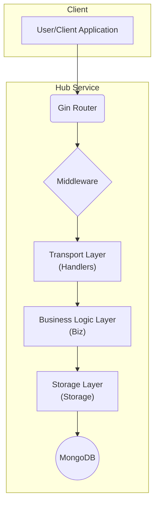
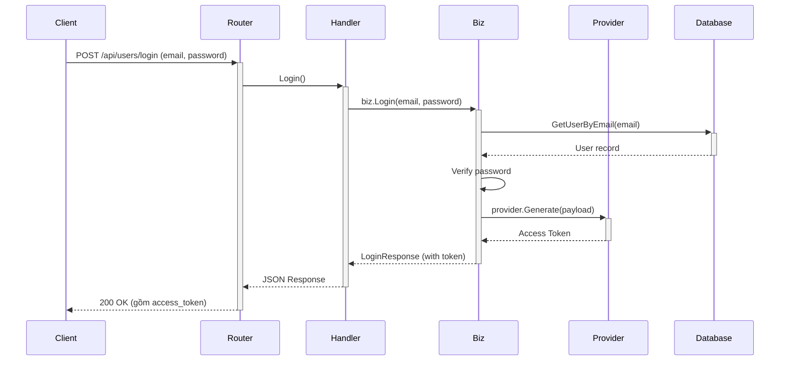
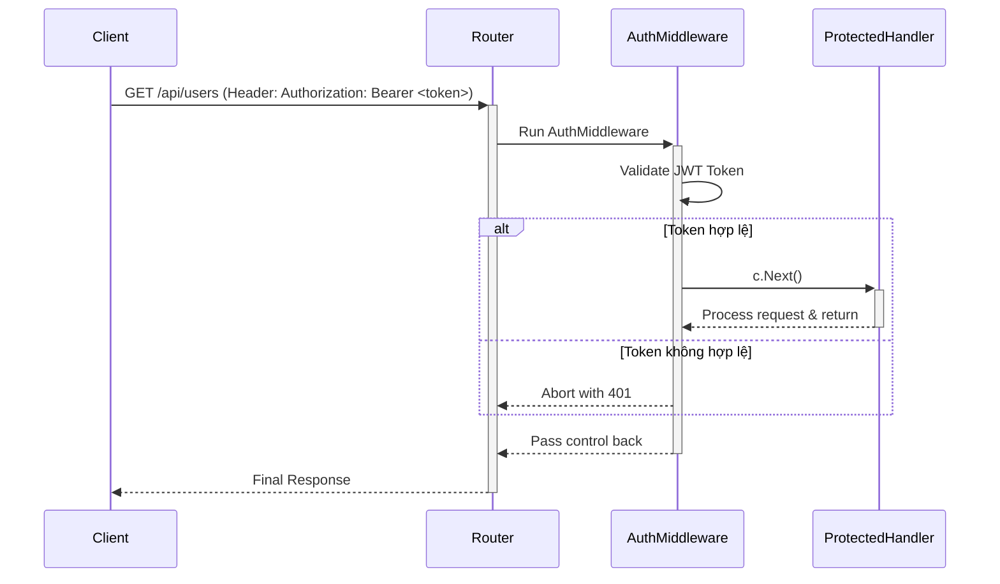
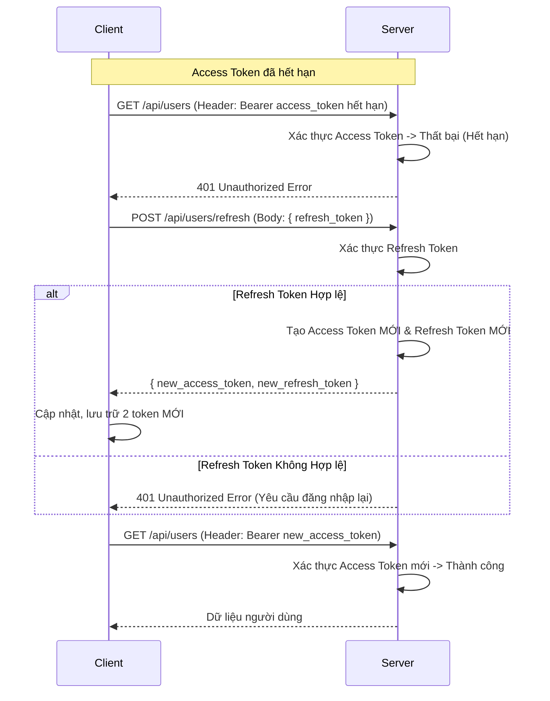

# Hub Service API

## ✨ Tính năng

-   **Xác thực người dùng**: Đăng ký, Đăng nhập sử dụng JWT (JSON Web Tokens).
-   **Quản lý người dùng**: Các API theo chuẩn CRUD (Create, Read, Update, Delete) cho module người dùng.
-   **Kiến trúc Layered**: Phân tách rõ ràng giữa các lớp Transport, Business, và Storage.
-   **Middleware**: Tích hợp sẵn middleware cho logging, phục hồi (recovery) và xác thực (authentication).
-   **Tài liệu API**: Tự động sinh tài liệu API với Swagger.
-   **Quản lý cấu hình**: Dễ dàng quản lý cấu hình môi trường qua file `.env`.

## 🏗️ Kiến trúc Tổng quan

## ⚙️ Luồng hoạt động chính

### 1. Luồng đăng nhập và tạo Access Token

Đây là quá trình người dùng cung cấp thông tin xác thực (email và password) để nhận về một `access_token`. Token này giống như một chiếc chìa khóa tạm thời để truy cập các tài nguyên khác.

### 2. Luồng xác thực Access Token khi gọi API

Khi đã có `access_token`, người dùng sẽ đính kèm nó vào header `Authorization` của mỗi request đến các API cần xác thực. Middleware sẽ kiểm tra tính hợp lệ của token trước khi cho phép request đi tiếp.

### 3. Luồng Làm Mới Token (Refresh Token)

Để cải thiện trải nghiệm người dùng, thay vì bắt họ đăng nhập lại mỗi khi `access_token` (ngắn hạn) hết hạn, hệ thống sử dụng một `refresh_token` (dài hạn) để lấy một cặp token mới.

-   **Access Token**: Thời gian sống ngắn (ví dụ: 15 phút), dùng để truy cập tài nguyên.
-   **Refresh Token**: Thời gian sống dài (ví dụ: 30 ngày), chỉ dùng để lấy `access_token` mới.

Dưới đây là sơ đồ mô tả luồng hoạt động khi `access_token` hết hạn:

