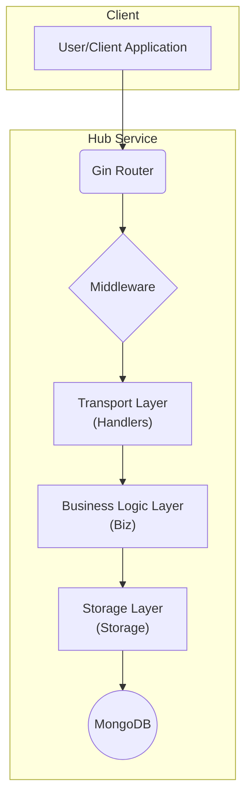
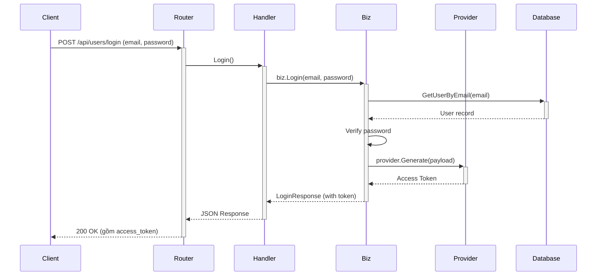

# Hub Service API

Một backend service được xây dựng bằng Go và Gin framework, cung cấp các RESTful API cho các hoạt động của một hub trung tâm, bao gồm quản lý người dùng, xác thực và các tính năng khác.

## ✨ Tính năng

-   **Xác thực người dùng**: Đăng ký, Đăng nhập sử dụng JWT (JSON Web Tokens).
-   **Quản lý người dùng**: Các API theo chuẩn CRUD (Create, Read, Update, Delete) cho module người dùng.
-   **Kiến trúc Layered**: Phân tách rõ ràng giữa các lớp Transport, Business, và Storage.
-   **Middleware**: Tích hợp sẵn middleware cho logging, phục hồi (recovery) và xác thực (authentication).
-   **Tài liệu API**: Tự động sinh tài liệu API với Swagger.
-   **Quản lý cấu hình**: Dễ dàng quản lý cấu hình môi trường qua file `.env`.

## 🏗️ Kiến trúc Tổng quan



## ⚙️ Luồng hoạt động chính

### 1. Luồng đăng nhập và tạo Access Token

Đây là quá trình người dùng cung cấp thông tin xác thực (email và password) để nhận về một `access_token`. Token này giống như một chiếc chìa khóa tạm thời để truy cập các tài nguyên khác.



### 2. Luồng xác thực Access Token khi gọi API

Khi đã có `access_token`, người dùng sẽ đính kèm nó vào header `Authorization` của mỗi request đến các API cần xác thực. Middleware sẽ kiểm tra tính hợp lệ của token trước khi cho phép request đi tiếp.

```mermaid
sequenceDiagram
    participant Client
    participant Router
    participant AuthMiddleware as Middleware
    participant ProtectedHandler as Handler

    Client->>+Router: GET /api/users (Header: Authorization: Bearer <token>)
    Router->>+Middleware: Run AuthMiddleware
    Middleware->>Middleware: Validate JWT Token

    alt Token hợp lệ
        Middleware->>+Handler: c.Next()
        Handler-->>-Middleware: Process request & return
    else Token không hợp lệ
        Middleware-->>-Router: Abort with 401
    end

    Middleware-->>-Router: Pass control back
    Router-->>-Client: Final Response
```
